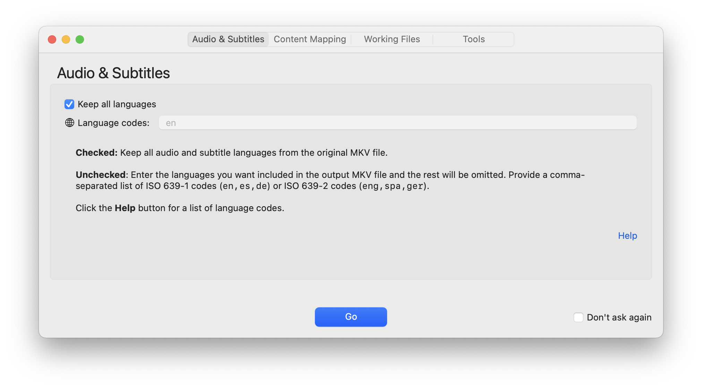

# DV7 to DV8

A Dolby Vision profile 7 to Dolby Vision profile 8.1 conversion app for macOS. 

The app can also be used to remove DV CMv4.0 metadata from an existing DV 8.1 video stream.

The script without the app is also compatible with common Unix/Linux distros.



# macOS Installation

- Download the latest [release](https://github.com/nekno/DV7toDV8/releases)
- Extract the `.zip` file
- Drag & drop the `DV7 to DV8` app to your `Applications` folder
- The bundled `mkvtoolnix` utilities aren't available in Universal binaries, so that means if you're using an Apple silicon Mac, you'll need to install [Rosetta 2](https://en.wikipedia.org/wiki/Rosetta_(software)#Rosetta_2) directly from Apple:
  - Launch the **Terminal** app
  - Type `softwareupdate --install-rosetta` and hit `return`
  - Accept the license agreement
- The app has not been digitally signed by an Apple Developer ID, so you will need to approve the app for the first run
  - For macOS Sequoia (15.x):
    - Double-click on the app to attempt to run it
    - On the **"DV7 to DV8" Not Opened** security prompt, click **Done**
    - Open **** menu > **System Settings...**
    - In the sidebar, select **Privacy & Security**
    - Scroll down to the **Security** section
    - Find the row that says **"DV7 to DV8" was blocked to protect your Mac.**
    - Click **Open Anyway**
    - On the security prompt, click **Open Anyway** again
    - On the authentication prompt, authenticate with Touch ID or enter your password
    - The app will launch
  - For macOS Ventura (13.5+) through macOS Sonoma (14.x):
    - Do one of the following:
      - Right-click on the app icon with your mouse and select **Open**
      - Ctrl-click on the app icon with your mouse and select **Open**
      - Two-finger tap on the app icon with your trackpad and select **Open**
    - Approve the security prompt to allow the app to run
    - The app will launch

# App Usage

- When you launch the app, you'll be prompted to select a folder
- Select a folder that contains Dolby Vision profile 7 `.mkv` files you want to convert to Dolby Vision profile 8.1, or DV 8.1 files you want to process to remove DV Content Mapping v4.0 metadata
- You can select a folder to process by doing one of the following:
  - Double-click on the app icon to launch the app, then select a folder in the Open Folder window
  - Drag & drop a folder onto the app icon in the Finder or Dock
  - When the app is already running, drag & drop a folder onto the main window 
  - When the app is already running, use the **File** menu > **Open** option and select a folder
- The **DV7 to DV8 Settings** app will launch
  - Explanations of each setting are included in the app
  - If you want to use the settings for all future runs of the app, check the **Don't ask again** box
  - If you want to reconfigure settings later, launch the app with the `--show settings` option:
    - Open **Terminal**
    - Enter `open -a "/Applications/DV7 to DV8.app" --args --show-settings`
    - The app will launch, prompt to select a folder to process, and then launch the settings app
- The app will process each `.mkv` file in the folder, performing the following:
  - Demux the DV7 BL+EL+RPU HEVC video stream from the MKV container
  - Demux the DV7 EL+RPU enhancement layer from the HEVC stream for your archival purposes (delete this file if you don't care to be able to reconstruct the DV7 BL+EL+RPU in the future)
  - Convert the DV7 BL+EL+RPU to DV8 BL+RPU, removing tone mappings specific to DV7, and optionally removing the CMv4.0 metadata
  - Optionally delete the demuxed DV7 BL+EL+RPU HEVC file to conserve disk space
  - Extract the DV8 RPU from the DV8 BL+RPU HEVC stream
  - Plot a graph of the L1 metadata and render it into a PNG
  - Remux the DV8 BL+RPU HEVC stream into a new MKV file with the non-video tracks from the original MKV file, optionally stripping unneeded audio & subtitle languages
  - Optionally delete the DV8 BL+RPU HEVC and RPU working files

# Script Usage

The `DV7toDV8.sh` script offers a more transparent but less streamlined approach compared to the app. It provides options for customization on the command line.

```bash
./DV7toDV8.sh [OPTIONS] [PATH]
```

## Options

### `-h` or `--help`

Display the help message detailing script usage.

### `-k` or `--keep-files`

**Enabled**: Keep all intermediate working files demuxed from the input MKV file or generated during processing.

**Disabled** (default): Keep only files that are useful for archiving or analyzing the result of processing, including the Enhancement Layer (EL+RPU) from the DV7 input file, the DV8 RPU file after conversion, and a graph of the metadata plotted over the duration of the video.

### `-l` or `--languages`

Specify comma-separated language codes for audio and subtitle tracks to include in the final `.mkv` file. You can provide [ISO 639-1 codes (`en,es,de`) or ISO 639-2 codes (`eng,spa,ger`)](https://www.loc.gov/standards/iso639-2/php/English_list.php). If not specified, all tracks are included by default.

### `-r` or `--remove-cmv4`

**Enabled**: Remove the Dolby Vision Content Mapping v4.0 (CMv4.0) dynamic metadata from the output video. This option is compatible with the Apple TV 4K (2021) and leaves the CMv2.9 metadata intact.

**Disabled** (default): Leave the CMv4.0 metadata intact (if present) in the output video. This option is compatible with the Apple TV 4K (2023).

### `-u` or `--use-system-tools`

**Enabled**: Use the `dovi_tool` and `mkvtoolnix` binaries installed on the local system.

**Disabled** (default): Use the binaries bundled with the app.

## Arguments

### `PATH`

Specify the path to the target directory containing the MKV files you want to process. If not specified, the current working directory (`$PWD`) is used.

## Example

Keep all working files, keep only English and Spanish audio tracks and subtitles, and remove the DV CMv4.0 metadata when processing all MKV files in the folder.
  
```bash
./DV7toDV8.sh -k -l eng,spa -r /path/to/folder/containing/mkvs
```

## macOS

- Download and extract the repo
- Run `DV7toDV8.sh` in Terminal, passing at least one argument for the folder location of the MKV files you want to convert
- On the first run of each utility, you'll need to approve the app to run and then re-run the script
- The bundled tools are unmodified versions of those publicly available, so if you're uncomfortable running the utilities downloaded in the `tools` folder, you can download and use your own copies of `dovi_tool` and `mkvtoolnix` (both can be installed via Homebrew)
  - If you choose to use your own copies of the utilities, you can pass the `-u` or `--use-system-tools` flag to the script to use the local versions
  - If you install the tools using Homebrew, they will be added to your PATH and the script will automatically use them
  - If you install the tools manually, you will need to add the directory containing the tools to your PATH
  - Finally, you can alternatively update `DV7toDV8.sh` to point to the location of the tools on your system
- To approve the tools to run, you can run each tool in the `tools` folder in Terminal, or just run the script repeatedly (passing a folder containing MKV files as an argument)
  - Run the script once
  - Open the **System Settings** app
  - In the sidebar, select **Privacy & Security**
  - Scroll down to the **Security** section
  - Approve the `mkvextract` utility to run
  - Run the script again
  - Approve the `DV7 to DV8 Settings` app to run
  - Run the script again
  - Approve the `dovi_tool` utility to run
  - Run the script again
  - Approve the `mkvmerge` utility to run
- All utilities should now be approved and the script can be run normally

## Linux

- The steps for running the script on Linux are similar to those for macOS with a few exceptions
  - The script will not prompt you to enter language codes. These can be specified using the `-l` flag or ommitted to include all tracks.
  - The script will not prompt you to approve the tools to run. As long as the tools are executable, they should run without issue.

# Building

This project leverages [Platypus](https://sveinbjorn.org/platypus) to create a macOS app bundle from a Bash script.

- Clone the **DV7toDV8** repo in the `~/Documents/Xcode/DV7toDV8` folder
- Install Platypus 5.4.1 or greater via [download](https://sveinbjorn.org/files/software/platypus.zip) or Homebrew
  ```bash
  $ brew install --cask platypus 
  ```
- In macOS Ventura 13 or greater (substitute similar steps for macOS <13):
  - Open the **System Settings** app
  - In the sidebar, select **Privacy & Security**
  - In the main window, select **Full Disk Access**
  - Click the **+** sign in the lower left
  - Select the **Platypus** app from the `Applications` folder and click **Open**
- Launch **Platypus**
  - Select **Profiles** menu > **Load Profile...**
  - Open the `~/Documents/Xcode/DV7toDV8/src/DV7 to DV8.platypus` file
  - If the location where you've stored the files on disk doesn't match `~/Documents/Xcode/DV7toDV8/src/`, set the following locations:
    - **Script Path**: `DV7toDV8.sh`
    - **Bundled Files**:
      - `tools` folder
      - `config` folder

## Building The Settings App

- In **Xcode 16.2+**, open `src/DV7toDV8/DV7toDV8.xcodeproj`
- Build and run for a debug build, or archive a release build
- Place **DV7 to DV8 Settings.app** in the `src/tools` folder to get bundled with the **DV7 to DV8** app by Platypus
